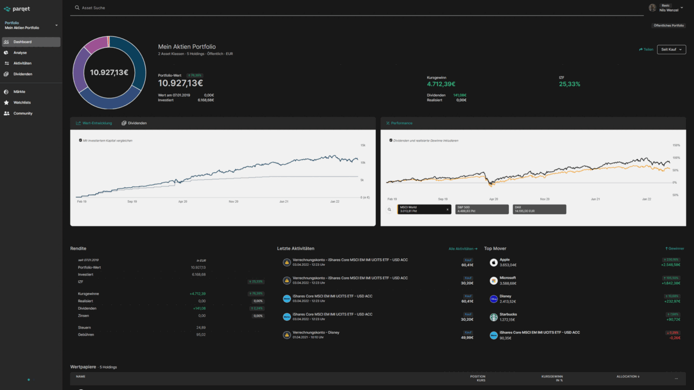

# Parqet darkmode


<br/>

Darkmode for parqet.com as a Chrome Web Extension. <br/>
Also works with [Safari](#safari) and [Firefox](#firefox) using a script runner.

[German version](./docs/readme_ger.md)

<br/>

## Information
Since parqet has no darkmode yet, I’ve decided to create one myself. For examples check out the images. If you find a bug don’t hesitate to contact me and let me know.

The darkmode can be deactivated/activated at any time in the popup.

- tested on Mac/Windows (Chrome Version 100.0.4896.75)
- (unofficial)

## What is parqet?
[Parqet](https://www.parqet.com) enables you to visualize and analyze your portfolio and keep track of your assets at any time.

## Usage

### Chromium based browser (Chrome, Opera, ...)
- download the [extension](https://chrome.google.com/webstore/detail/parqet-darkmode/jfhpcliegfecjhjehclnhnngbjndodoj?hl) and reload parqet.com. The darkmode is automatically activated.

### Safari
1. download [Userscripts](https://apps.apple.com/us/app/userscripts/id1463298887) extension from the App Store
2. open Safari
3. activate Userscripts in the settings
4. click on the Userscripts-icon and then on "open extension page"
5. in there click on the "plus"-icon and then "new css"
6. copy the following:
    ```
    /* ==UserStyle==
    @name        Parqet Darkmode
    @description Darkmode for parqet.com
    @match       https://app.parqet.com/*
    ==/UserStyle== */

    @import url("https://cdn.statically.io/gh/nilswenzel/parqet-darkmode-chrome-extension/main/darkmode.min.css");
    ```
    and paste it
7. save the file (CMD + s)
8. reload parqet.com (if it doesn't work properly after the first reload you might have to reload the page again)

### Firefox
1. download the [CustomCSS Injector](https://addons.mozilla.org/de/firefox/addon/customcss-injector/) addon
2. click on the newly appeared CustomCSS Injector icon
3. paste in the following css:
    ```
    @import url("https://cdn.statically.io/gh/nilswenzel/parqet-darkmode-chrome-extension/main/extension/darkmode.min.css");
    ```
4. and use `app.parqet.com` as the whitelist domain
5. save and reload parqet.com


## Support me
If you want to support me you can do this [here](https://www.paypal.com/paypalme/nilswenzel01).